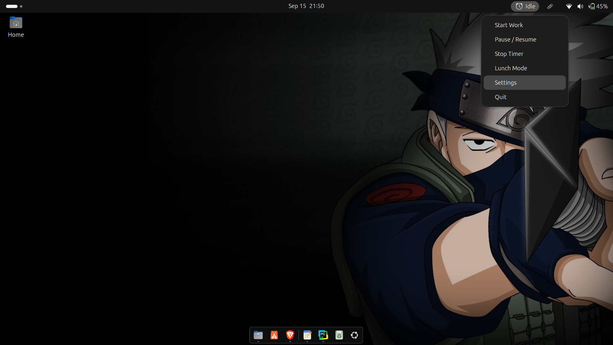

#  Pomodoro AppIndicator for Ubuntu

A simple **Pomodoro timer for Linux** that lives in your system tray (AppIndicator, beside the date & time).  
Supports the classic **25+5 Pomodoro technique**, plus lunch breaks, walk reminders, notifications, sounds, pause/resume, stop, and auto-pause on system lock.

---

## ✨ Features
-  **Work / Break Cycles**: 25 min focus, 5 min short break, 10 min long break after 4 cycles
- 🍴 **Lunch Mode**: custom lunch duration, followed by a 5 min walk reminder 🚶
- 🔔 **Gentle sound + desktop notification** at each cycle change
- ⏸ **Pause / Resume**
- ⏹ **Stop Timer** (reset to idle)
- 🔒 **Auto-pause on lock** (optional, configurable in settings)
- ⚙️ **Settings window** for durations, sound selection, and lock-pause toggle
- 🔁 **Autostart** support via `.desktop` file

## 🛠 Requirements

### System Packages (Ubuntu/Debian)
```bash
sudo apt update
sudo apt install -y python3-gi python3-gi-cairo gir1.2-gtk-3.0 gir1.2-appindicator3-0.1 gir1.2-notify-0.7 libgirepository1.0-dev libcairo2-dev libglib2.0-dev libnotify-dev libayatana-appindicator3-dev pkg-config
```

### Python Dependencies

Install from `requirements.txt`:

```bash
pip install -r requirements.txt
```

---

## ▶️ Usage

1. Clone or download this repository.
2. Make the script executable:

   ```bash
   chmod +x pomodoro.py
   ```
3. Run it:

   ```bash
   ./pomodoro.py
   ```
4. Look for the  icon in your **top bar tray** (beside date & time).

---

## 🔁 Autostart on Login

To run automatically every time you log in:

1. Create `~/.config/autostart/pomodoro.desktop`

   ```ini
   [Desktop Entry]
   Type=Application
   Exec=/usr/bin/python3 /home/YOUR_USER/pomodoro.py
   Hidden=false
   NoDisplay=false
   X-GNOME-Autostart-enabled=true
   Name=Pomodoro Timer
   Comment=Productivity timer
   ```
2. Reboot → the timer will launch automatically.

---

## ⚙️ Configuration

* Config file is stored in `./pomodoro_config.json`
* You can edit it manually or use the **Settings window** in the tray menu
* Adjustable values:

  * Work, Short Break, Long Break, Lunch, Walk After Lunch durations
  * Pause on Lock (true/false)
  * Custom Sound Path (pick your own `.wav`/`.ogg`)

---

## 📷 Screenshots



---

## 👤 Author

- Name: Anurag Pandey
- Email: annup76779@gmail.com
- GitHub: https://github.com/annup76779
---

## 📝 License

MIT License – free to use, modify, and share.
